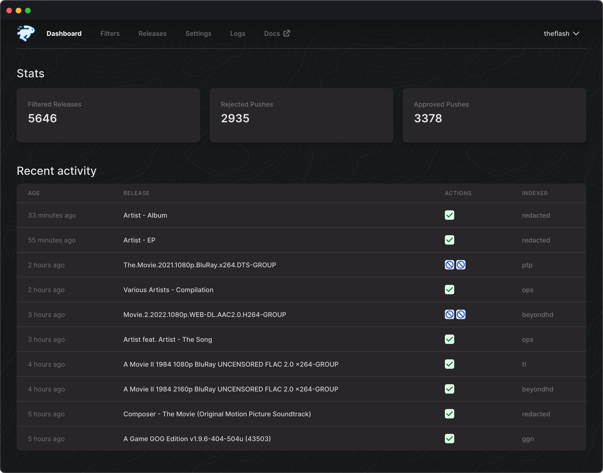

<h1 align="center">
  <br/>
  autobrr
</h1>

<p align="center">autobrr is the modern download automation tool for torrents.
With inspiration and ideas from tools like trackarr, autodl-irssi and flexget we built one tool that can do it all, and then some.</p>

<p align="center">&nbsp;&nbsp;</p>

<br/>


## Documentation

Installation guide and documentation can be found at https://autobrr.com

## Key features

- Support for 45+ trackers with IRC announces
- Torznab/RSS support via Prowlarr to easily get access to hundreds of trackers
- Powerful but simple filtering with RegEx support (like in autodl-irssi)
- Easy to use and mobile friendly web UI (with dark mode!) to manage everything
- Built on Go and React making autobrr lightweight and perfect for supporting multiple platforms (Linux, FreeBSD, Windows, macOS) on different architectures (e.g. x86, ARM)
- Great container support (Docker, k8s/Kubernetes)
- Database engine supporting both PostgreSQL and SQLite
- Notifications (Discord, Telegram, Notifiarr)
- One autobrr instance can communicate with multiple clients (both torrent and \*arr) on remote servers
- Base path / Subfolder (and subdomain) support for convenient reverse-proxy support

Available download clients and actions

- qBittorrent (with built in re-announce, categories, rules, max active downloads, etc)
- Deluge v1+ and v2+
- rTorrent
- Transmission
- Sonarr, Radarr, Lidarr, Whisparr and Readarr (pushes releases directly to them and gets in the early swarm, instead of getting them via RSS when it's already over)
- Watch folder
- Exec custom scripts
- Webhook

## Installation

Full installation guide and documentation can be found at https://autobrr.com

Remember to head over to our [Configuration Guide](https://autobrr.com/configuration/autobrr) to learn how to set up your indexers, IRC, and download clients after you're done installing.

### Swizzin

[Swizzin](https://swizzin.ltd/) users can simply run:

```
sudo box install autobrr
```


### Saltbox

[Saltbox](https://saltbox.dev/) users can simply run:

```
sb install sandbox-autobrr
```

For more info check the [docs](https://docs.saltbox.dev/sandbox/apps/autobrr/)

### QuickBox (v3)

[QuickBox](https://quickbox.io/) users can simply run:

```
qb install autobrr -u ${username}
```

For more info check the [docs](https://quickbox.io/knowledge-base/v3/applications-v3/autobrr-applications-v3/autobrr-quick-reference/)

### Shared seedbox

We have support for a couple of providers out of the box and if yours are missing then please write on Discord so we add support.

The scripts require some input but does most of the work.

#### Seedbox.io 

    curl https://gobrr.sh/install_sbio | bash

#### Swizzin.net

    curl https://gobrr.sh/install_sbio | bash

#### Ultra.cc

    curl https://gobrr.sh/install_ultra | bash

#### WhatBox
    
    curl https://gobrr.sh/install_whatbox | bash

#### Other providers

For other providers the Seedboxio installer should work. If not, open an issue or contact us on [Discord](https://discord.gg/WQ2eUycxyT)

    curl https://gobrr.sh/install_sbio | bash

### Docker compose

docker-compose for autobrr. Modify accordingly if running with unRAID or setting up with Portainer.

* Logging is optional
* Host port mapping might need to be changed to not collide with other apps
* Change `BASE_DOCKER_DATA_PATH` to match your setup. Can be simply `./data`
* Set custom network if needed

Create `docker-compose.yml` and add the following. If you have a existing setup change to fit that.

```yml
version: "3.7"

services:
  autobrr:
    container_name: autobrr
    image: ghcr.io/autobrr/autobrr:latest
    restart: unless-stopped
    environment:
      - PUID=${PUID}
      - PGID=${GUID}
      - TZ=${TZ}
    volumes:
      - ${BASE_DOCKER_DATA_PATH}/autobrr/config:/config
    ports:
      - 7474:7474
```

Then start with

    docker compose up -d

### Windows

Check the windows setup guide [here](https://autobrr.com/installation/windows)

### Linux generic


Download the latest release, or download the [source code](https://github.com/autobrr/autobrr/releases/latest) and build it yourself using `make build`.

```bash
wget $(curl -s https://api.github.com/repos/autobrr/autobrr/releases/latest | grep download | grep linux_x86_64 | cut -d\" -f4)
```

#### Unpack

Run with `root` or `sudo`. If you do not have root, or are on a shared system, place the binaries somewhere in your home directory like `~/.bin`.

```bash
tar -C /usr/local/bin -xzf autobrr*.tar.gz
```

This will extract both `autobrr` and `autobrrctl` to `/usr/local/bin`.
Note: If the command fails, prefix it with `sudo ` and re-run again.

#### Systemd (Recommended)

On Linux-based systems, it is recommended to run autobrr as sort of a service with auto-restarting capabilities, in order to account for potential downtime. The most common way is to do it via systemd.

You will need to create a service file in `/etc/systemd/system/` called `autobrr.service`.

```bash
touch /etc/systemd/system/autobrr@.service
```

Then place the following content inside the file (e.g. via nano/vim/ed):

```systemd title="/etc/systemd/system/autobrr@.service"
[Unit]
Description=autobrr service for %i
After=syslog.target network-online.target

[Service]
Type=simple
User=%i
Group=%i
ExecStart=/usr/bin/autobrr --config=/home/%i/.config/autobrr/

[Install]
WantedBy=multi-user.target
```

Start the service. Enable will make it startup on reboot.

```bash
systemctl enable -q --now --user autobrr
```

It's highly advised to put it behind a reverse-proxy like nginx or traefik etc.

## Community

Come join us on [Discord](https://discord.gg/WQ2eUycxyT)!