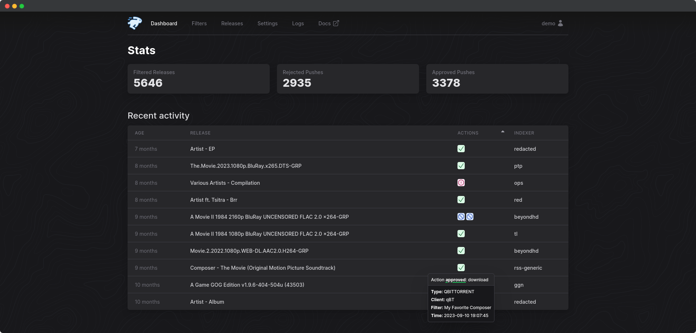

<h1 align="center">
  <br/>
  autobrr
</h1>

<p align="center">autobrr redefines download automation for torrents and Usenet, drawing inspiration from tools like trackarr, autodl-irssi, and flexget. We've combined the best of these worlds into one versatile tool that can do it all, and then some.</p>

<p align="center">&nbsp;&nbsp;</p>

<br/>
*We also have a light theme. Check it out [here](.github/images/front-light.png).*

## Documentation

Full documentation can be found at [https://autobrr.com](https://autobrr.com)

## Table of Contents

1. [What Is Autobrr?](#what-is-autobrr)
2. [Key Features](#key-features)
   - [Available Download Clients and Actions](#available-download-clients-and-actions)
   - [RSS and Usenet Support](#rss-and-usenet-support)
3. [Installation](#installation)
   - [Swizzin](#swizzin-dedi)
   - [Saltbox](#saltbox)
   - [QuickBox](#quickbox)
   - [Shared Seedbox](#shared-seedbox)
   - [Docker Compose](#docker-compose)
      - [Distroless docker images](#distroless-docker-images)
   - [Windows](#windows)
   - [MacOS](#macos)
   - [Linux Generic](#linux-generic)
   - [Environment Variables](#environment-variables)
4. [Community](#community)
5. [Contributing](#contributing)
6. [Code of Conduct](#code-of-conduct)
7. [License](#license)

## What Is Autobrr?

What is autobrr, and how does it fit into the ecosystem?

We can start by talking about torrent trackers (hereby referred to as indexers) and maintaining ratio. You are required
to maintain a ratio with most indexers. Ratio is built by seeding your torrents. The earlier you're seeding a torrent,
the more peers you make yourself available to on that torrent.

Software like Radarr and Sonarr utilizes RSS to look for new torrents. RSS feeds are updated regularly, but too slow to
let you be a part of what we call the initial swarm of a torrent. This is where autobrr comes into play.

Many indexers announce new torrents on their IRC channels the second it is uploaded to the site. autobrr monitors such
channels in real time and grabs the torrent file as soon as it's uploaded based on certain conditions (hereby referred
to as filters) that you set up within autobrr. It then sends that torrent file to a download client of your choice via
an action set within the filter. A download client can be anything from qBittorrent and Deluge, to Radarr and Sonarr, or
a watch folder.

When your autobrr filter is set to send the torrent files to Radarr and Sonarr, they will decide if it's something they
want, and then forward it to the torrent client they are set up with.

autobrr can also send matches (torrent files that meets your filter's criteria) directly to torrent clients like
qBittorrent, Deluge, r(u)Torrent and Transmission. You don't need to use the *arr suite to make use of autobrr.

## Key Features

- Torrents and Usenet support
- Support for 75+ torrent trackers with IRC announces
- Newznab, Torznab and RSS support to easily get access to hundreds of torrent and Usenet indexers
- Torrent Magnet support
- Powerful but simple filtering with RegEx support (like in autodl-irssi)
- Easy to use and mobile friendly web UI (with dark mode!) to manage everything
- Built on Go and React making autobrr lightweight and perfect for supporting multiple platforms (Linux, FreeBSD,
  Windows, macOS) on different architectures (e.g. x86, ARM)
- Great container support (Docker, k8s/Kubernetes)
- Database engine supporting both PostgreSQL and SQLite
- Authentication support including built-in auth and OpenID Connect (OIDC)
- Notifications (Discord, Telegram, Notifiarr, Pushover, Gotify)
- One autobrr instance can communicate with multiple clients (torrent, Usenet and \*arr) on remote servers
- Base path / Subfolder (and subdomain) support for convenient reverse-proxy support

### Available Download Clients and Actions

- **qBittorrent:** Includes built-in re-announce, categories, rules, max active downloads, etc.
- **Deluge v1+ and v2+**
- **rTorrent**
- **Transmission**
- **Porla**
- **Sonarr, Radarr, Lidarr, Whisparr, Readarr:** Pushes releases directly for early swarm participation, rather than relying on RSS feeds.
- **SABnzbd (Usenet):** Integrates smoothly for Usenet downloads.
- **Watch Folder:** Monitors specified folders for new files.
- **Exec Custom Scripts:** Execute tailored scripts for advanced automation.
- **Webhook:** Offers webhook support for diverse integration needs.

### RSS and Usenet Support

A lot of indexers do not announce new torrents in an IRC channel. You can still make use of these indexers with autobrr
since it has built in support for feeds as well. Both Torznab, Newznab and regular RSS is supported. RSS indexers are treated the same way as regular indexers within autobrr.

Usenet support via Newznab feeds allows you to easily manage everything in a single application. While there is a lot of
applications that handles RSS well, we think autobrr offers very easy to use filtering to help you get the content you
want.

You can use Usenet feeds and send to arrs or send directly to SABnzbd.

## Installation

For comprehensive installation instructions, visit our [Installation Guide](https://autobrr.com/installation/linux). This guide provides detailed steps for different platforms, including Windows, Linux, Docker, and more.

Remember to head over to our [Configuration Guide](https://autobrr.com/configuration/autobrr) to learn how to set up your indexers, IRC, and download clients after you're done installing.

### Swizzin (dedi)

[Swizzin](https://swizzin.ltd/) users can simply run:

```bash
sudo box install autobrr
```

### Saltbox

[Saltbox](https://docs.saltbox.dev/) users can simply run:

```bash
sb install autobrr
```

For more info check the [docs](https://docs.saltbox.dev/apps/autobrr/)

### QuickBox

[QuickBox](https://quickbox.io/) users can simply run:

```bash
qb install autobrr -u ${username}
```

For more info check
the [docs](https://quickbox.io/knowledge-base/v3/applications-v3/autobrr-applications-v3/autobrr-quick-reference/)

### Shared Seedbox

#### One-Click Installer & Quick Installer

- HostingByDesign (former Seedbox.io) via box - `box install autobrr`
- Swizzin.net via box - `box install autobrr`
- Seedit4.me
- SeedHost.eu
- Ultra.cc

##### Installation Scripts

We have support for a couple of other providers out of the box.  
Please contact us on [Discord](https://discord.gg/WQ2eUycxyT) if your provider is missing.
The scripts require some input, but do most of the work.

#### WhatBox

```bash
wget https://gobrr.sh/install_whatbox && bash install_whatbox
```

#### Feralhosting

```bash
wget https://gobrr.sh/install_feral && bash install_feral
```

#### Bytesized Hosting

```bash
wget https://gobrr.sh/install_bytesized && bash install_bytesized
```

#### Other providers

For other providers the Seedbox.io installer should work. If not, open an issue or contact us
on [Discord](https://discord.gg/WQ2eUycxyT)

```bash
wget https://gobrr.sh/install_sbio && bash install_sbio
```

### Docker Compose

Modify accordingly if running with unRAID or setting up with Portainer.

- Logging is optional
- Host port mapping might need to be changed to not collide with other apps
- Change `BASE_DOCKER_DATA_PATH` to match your setup. Can be simply `./data`
- Set custom network if needed

Create `docker-compose.yml` and add the following. If you have an existing setup change to fit that.

```yml
version: "3.7"

services:
  autobrr:
    container_name: autobrr
    image: ghcr.io/autobrr/autobrr:latest
    restart: unless-stopped
    environment:
      - TZ=${TZ}
    user: 1000:1000
    volumes:
      - ${BASE_DOCKER_DATA_PATH}/autobrr/config:/config
    ports:
      - 7474:7474
```

Then start with:

```bash
docker compose up -d
```

### Distroless Docker Images

> [!CAUTION]
> This image comes without a shell, and external filtering and actions relying on `exec` will therefore not work with anything but compiled static binaries.
> 
> To clarify: **`BASH` and `SH` shell scripts WILL NOT WORK!**
>
> Use the standard image if you rely on this functionality.

For users who prioritize container security, one of the longterm maintainers offer alternative Docker images built on [Distroless](https://github.com/GoogleContainerTools/distroless). Specifically the `distroless/static-debian12:nonroot` base image.

Distroless images do not contain a package manager or shell, thereby reducing the potential attack surface and making them a more secure option. These stripped-back images contain only the application and its runtime dependencies.

The repository for these builds can be found here: [https://github.com/s0up4200/autobrr-distroless](https://github.com/s0up4200/autobrr-distroless)

### Windows

Check the Windows Setup Guide [here](https://autobrr.com/installation/windows).

### MacOS

#### Install Homebrew

```bash
/bin/bash -c "$(curl -fsSL https://raw.githubusercontent.com/Homebrew/install/HEAD/install.sh)"
```

#### Install autobrr

```bash
brew install autobrr
```

#### Run

```bash
brew services start autobrr
```

### Linux Generic

Download the latest release, or download the [source code](https://github.com/autobrr/autobrr/releases/latest) and build
it yourself using `make build`.

```bash
wget $(curl -s https://api.github.com/repos/autobrr/autobrr/releases/latest | grep download | grep linux_x86_64 | cut -d\" -f4)
```

#### Unpack

Run with `root` or `sudo`. If you do not have root, or are on a shared system, place the binaries somewhere in your home directory like `~/.bin`.

```bash
tar -C /usr/local/bin -xzf autobrr*.tar.gz
```

This will extract both `autobrr` and `autobrrctl` to `/usr/local/bin`.
Note: If the command fails, prefix it with `sudo` and re-run again.

#### Systemd (Recommended)

On Linux-based systems, it is recommended to run autobrr as a sort of service with auto-restarting capabilities, in
order to account for potential downtime. The most common way is to do it via systemd.

You will need to create a service file in `/etc/systemd/system/` called `autobrr.service`.

```bash
touch /etc/systemd/system/autobrr@.service
```

Then place the following content inside the file (e.g. via nano/vim/ed):

```systemd title="/etc/systemd/system/autobrr@.service"
[Unit]
Description=autobrr service for %i
After=syslog.target network-online.target

[Service]
Type=simple
User=%i
Group=%i
ExecStart=/usr/bin/autobrr --config=/home/%i/.config/autobrr/

[Install]
WantedBy=multi-user.target
```

Start the service. Enable will make it startup on reboot.

```bash
systemctl enable -q --now --user autobrr@$USER
```

By default, the configuration is set to listen on `127.0.0.1`. While autobrr works fine as is exposed to the internet,
it is recommended to use a reverse proxy
like [nginx](https://autobrr.com/installation/linux#nginx), [caddy](https://autobrr.com/installation/linux#caddy)
or [traefik](https://autobrr.com/installation/docker#traefik).

If you are not running a reverse proxy change `host` in the `config.toml` to `0.0.0.0`.

### Environment Variables

The following environment variables can be used:

| Variable                          | Description                                              | Default                                  |
| --------------------------------- | -------------------------------------------------------- | ---------------------------------------- |
| `AUTOBRR__HOST`                   | Listen address                                           | `127.0.0.1`                              |
| `AUTOBRR__PORT`                   | Listen port                                              | `7474`                                   |
| `AUTOBRR__BASE_URL`               | Base URL for reverse proxy                               | `/`                                      |
| `AUTOBRR__LOG_LEVEL`              | Log level (DEBUG, INFO, WARN, ERROR)                     | `INFO`                                   |
| `AUTOBRR__LOG_PATH`               | Log file location                                        | `/config/logs`                           |
| `AUTOBRR__LOG_MAX_SIZE`           | Max size in MB before rotation                           | `10`                                     |
| `AUTOBRR__LOG_MAX_BACKUPS`        | Number of rotated logs to keep                           | `5`                                      |
| `AUTOBRR__SESSION_SECRET`         | Random string for session encryption                     | -                                        |
| `AUTOBRR__CUSTOM_DEFINITIONS`     | Path to custom indexer definitions                       | -                                        |
| `AUTOBRR__CHECK_FOR_UPDATES`      | Enable update checks                                     | `true`                                   |
| `AUTOBRR__DATABASE_TYPE`          | Database type (sqlite/postgres)                          | `sqlite`                                 |
| `AUTOBRR__POSTGRES_HOST`          | PostgreSQL host                                          | -                                        |
| `AUTOBRR__POSTGRES_PORT`          | PostgreSQL port                                          | `5432`                                   |
| `AUTOBRR__POSTGRES_DATABASE`      | PostgreSQL database name                                 | -                                        |
| `AUTOBRR__POSTGRES_USER`          | PostgreSQL username                                      | -                                        |
| `AUTOBRR__POSTGRES_PASS`          | PostgreSQL password                                      | -                                        |
| `AUTOBRR__POSTGRES_SSLMODE`       | PostgreSQL SSL mode                                      | `disable`                                |
| `AUTOBRR__POSTGRES_EXTRA_PARAMS`  | Additional PostgreSQL parameters                         | -                                        |
| `AUTOBRR__OIDC_ENABLED`           | Enable OpenID Connect authentication                     | `false`                                  |
| `AUTOBRR__OIDC_ISSUER`            | OIDC issuer URL                                          | -                                        |
| `AUTOBRR__OIDC_CLIENT_ID`         | OIDC client ID                                           | -                                        |
| `AUTOBRR__OIDC_CLIENT_SECRET`     | OIDC client secret                                       | -                                        |
| `AUTOBRR__OIDC_REDIRECT_URL`      | OIDC callback URL                                        | `https://baseurl/api/auth/oidc/callback` |
| `AUTOBRR__DISABLE_BUILT_IN_LOGIN` | Disable login form (only works when using external auth) | `false`                                  |

## Community

Join our friendly and welcoming community on [Discord](https://discord.gg/WQ2eUycxyT)! Connect with fellow autobrr users, get advice, and share your experiences. Whether you're seeking help, wanting to contribute, or just looking to discuss your ideas, our community is a hub of discussion and support. We're all here to help each other out, so don't hesitate to jump in!

## Contributing

Whether you're fixing a bug, adding a feature, or improving documentation, your help is appreciated. Here's how you can contribute:

### Reporting Issues and Suggestions

- **Report Bugs:** Encountered a bug? Please report it using our [bug report template](/.github/ISSUE_TEMPLATE/bug_report.md). Include detailed steps to reproduce, expected behavior, and any relevant screenshots or logs.
- **Feature Requests:** Submit your feature request by [opening a new idea in our discussions](https://github.com/autobrr/autobrr/discussions/new?category=ideas). Describe your idea and how it will improve `autobrr`.

### Code Contributions

Check out the full guide for contributing [here](CONTRIBUTING.md).

- **Fork and Clone:** Fork the `autobrr` repository and clone it to start working on your changes.
- **Branching:** Create a new branch for your changes. Use a descriptive name for easy understanding.
- **Coding:** Ensure your code is well-commented for clarity.
- **Commit Guidelines:** We appreciate the use of [Conventional Commit Guidelines](https://www.conventionalcommits.org/en/v1.0.0/#summary) when writing your commits.
  - There is no need for force pushing or rebasing. We squash commits on merge to keep the history clean and manageable.
- **Pull Requests:** Submit a pull request with a clear description of your changes. Reference any related issues.
- **Code Review:** Be open to feedback during the code review process.

### Documentation

See an area that needs clarity or additional information? Feel free to update our documentation [here](https://github.com/autobrr/autobrr.com).

## Code of Conduct

We follow a code of conduct that promotes respectful and harassment-free experiences. Please read [our Code of Conduct](CODE_OF_CONDUCT.md) before participating.

## License

autobrr is proudly open-source and is released under the [GNU General Public License v2 or later (GPLv2+)](https://www.gnu.org/licenses/old-licenses/gpl-2.0-standalone.html). This license allows you the freedom to run, study, share, and modify the software:

- **Freedom to Run:** You can run autobrr in any environment, for any purpose.
- **Freedom to Study and Modify:** Access to the source code allows you to study and modify autobrr to suit your needs.
- **Freedom to Share:** You can redistribute copies of autobrr to help others.
- **Freedom to Enhance:** Contributions to improve autobrr are always welcome.

Copyright 2021-2024
